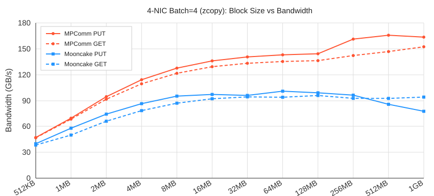
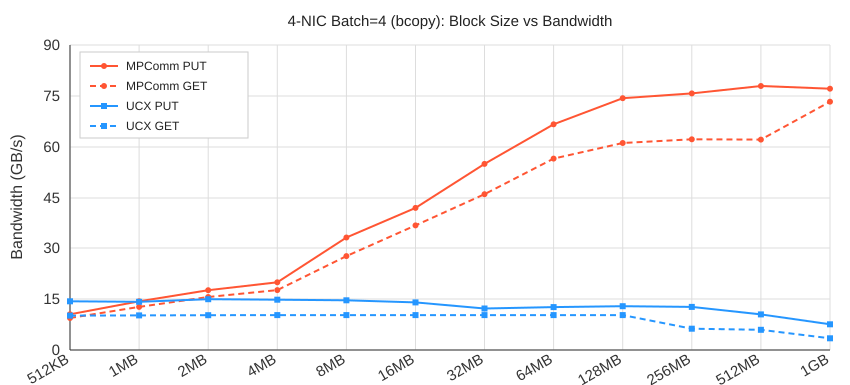

# MPComm

---

## 1. Overview

Large volumes of time-sensitive data—such as reinforcement learning datasets, R3 "expert IDs," and inference KV caches—are rapidly generated, transmitted, and consumed across diverse storage media like DRAM and HBM, giving rise to large-scale memory pooling architectures. In these pooling scenarios, traditional inter-memory communication schemes encounter bottlenecks such as inefficient bandwidth utilization and rigid communication patterns. Designed specifically for large-scale, heterogeneous memory pooling environments, the MPComm (Memory Pooling Communication) library addresses these limitations through extreme optimization, achieving performance levels that approach the physical limits of the hardware.

### Key Features

- **Native ibverbs one-sided ops** — RDMA WRITE / READ, bypassing the kernel and extra copies to reach remote memory directly.
- **Multi-NIC aggregation (multi-rail)** — a single `MPComm` instance stripes across multiple CX-7 NICs in parallel; bandwidth scales near-linearly with NIC count.
- **Multi-QP concurrency** — configurable QPs per NIC per connection (`MPCOMM_QPS_PER_CONNECTION`) for deeper pipelining.
- **NUMA affinity** — auto-detects NIC ↔ NUMA topology; allocates / publishes / matches buffers per NUMA node.
- **Two data paths** — **zero-copy** (pre-registered user buffer, direct one-sided access) and **non-zero-copy** (unregistered buffer routed through a multi-threaded staging pool).
- **HBM ↔ DRAM movement** — Hopper **TMA** (`cp.async.bulk`) and **SM int4-vectorized** H2D kernels (`tmaGather` / `tmaScatter`).

---

## 2. Getting Started

### 2.1 Dependencies

- Linux + Mellanox/NVIDIA RDMA NIC (RoCE / IB), with `rdma-core` / OFED installed
- `libnuma` (NUMA allocation)
- CUDA (optional; enables GPU direct and TMA kernels, requires sm_90+ / H100·H800·H20)
- CMake ≥ 3.x, C++17, Python ≥ 3.8

### 2.2 Build & Install

**Option A: CMake build (C++ + Python extension)**

```bash
cd trmt-mpcomm
sh build.sh
# Artifacts:
#   mpcomm-install/lib/libmpcomm.so
#   mpcomm-install/lib/python/mpcomm   (Python module)
```

To use it from Python without configuring PYTHONPATH, add it to your environment:

```bash
export PYTHONPATH=/path/to/trmt-mpcomm/mpcomm-install/lib/python:$PYTHONPATH
```

**Option B: install as a Python wheel**

```bash
pip install .          # or: sh build_wheel.sh
python -c "import mpcomm; print(mpcomm.__file__)"
```

---

## 3. Performance

**Test environment**: Tencent cluster, 2 × H20 nodes, single NUMA (1 CPU) × 4 CX-7 NICs (`mlx5_bond_1~4`, each a 2×200G bond) aggregated, `batch=4`, block size swept 512KB → 1GB.

### 3.1 Zero-copy path: MPComm vs native Mooncake RDMA

User buffers were pre-registered for RDMA and accessed directly, and were compared against Mooncake's native RDMA.



> MPComm clearly leads native RDMA on large blocks, up to **+110.9%** (1GB block PUT: 163.534 vs 77.530 GB/s).

### 3.2 Non-zero-copy path: MPComm vs UCX copy-in

User buffers are not registered but are instead routed through a multi-threaded staging pool, contrasting with UCX's copy-in mechanism.



> MPComm reaches **up to +2030.2%** (1GB block GET: 73.28 vs 3.44 GB/s).

---
