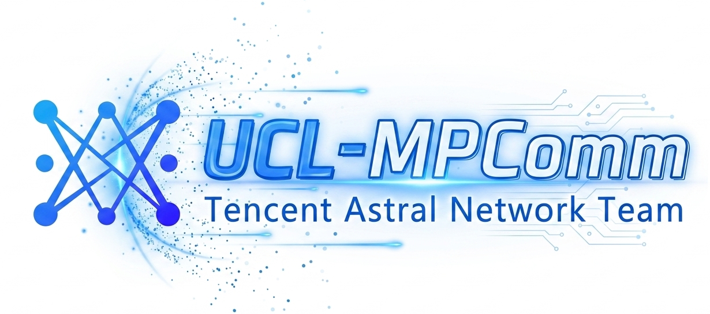
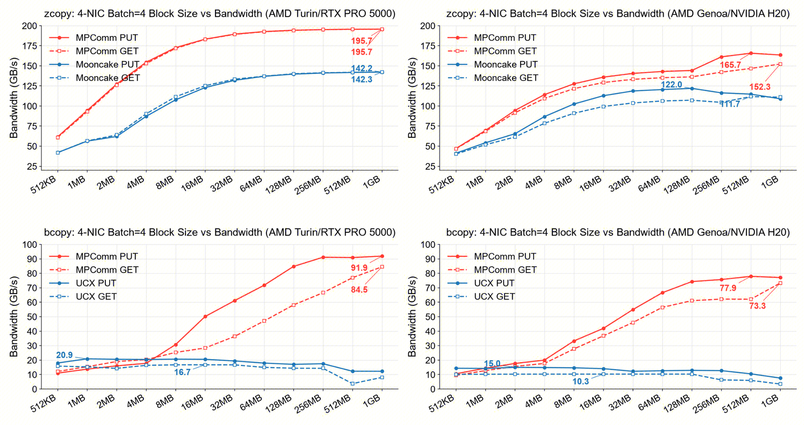

<div align="center">
  
  <h2 align="center">
    UCL-MPComm
  </h2>
  <p>
    <b>U</b>nified <b>C</b>ommunication <b>L</b>ibrary — <b>M</b>emory <b>P</b>ool <b>Comm</b>unication
  </p>
  <p>
    
    
    
    
  </p>
</div>

UCL-MPComm (Unified Communication Library — Memory Pool Communication) is a
**high-performance, RDMA-native data-plane library for large-scale heterogeneous
memory pools**, developed by the **Tencent Astral Network Team**.

Large volumes of time-sensitive data—such as reinforcement learning datasets,
R3 "expert IDs," and inference KV caches—are rapidly generated, transmitted, and
consumed across diverse storage media like DRAM and HBM, giving rise to
large-scale memory pooling architectures. In these pooling scenarios,
traditional inter-memory communication schemes encounter bottlenecks such as
inefficient bandwidth utilization and rigid communication patterns. Designed
specifically for large-scale, heterogeneous memory pooling environments,
UCL-MPComm addresses these limitations through extreme optimization, achieving
performance levels that approach the physical limits of the hardware.

<p align="center">
  <a href="#key-features">Key Features</a> |
  <a href="#getting-started">Getting Started</a> |
  <a href="#performance">Performance</a>
</p>

---

## Key Features

- **Native ibverbs one-sided ops** — RDMA WRITE / READ, bypassing the kernel and extra copies to reach remote memory directly.
- **Multi-NIC aggregation (multi-rail)** — a single `MPComm` instance stripes across multiple CX-7 NICs in parallel; bandwidth scales near-linearly with NIC count.
- **Multi-QP concurrency** — configurable QPs per NIC per connection (`MPCOMM_QPS_PER_CONNECTION`) for deeper pipelining.
- **NUMA affinity** — auto-detects NIC ↔ NUMA topology; allocates / publishes / matches buffers per NUMA node.
- **Two data paths** — **zero-copy** (pre-registered user buffer, direct one-sided access) and **non-zero-copy** (unregistered buffer routed through a multi-threaded staging pool).
- **HBM ↔ DRAM movement** — Hopper **TMA** (`cp.async.bulk`) and **SM int4-vectorized** H2D kernels (`tmaGather` / `tmaScatter`).

---

## Getting Started

### Dependencies

- Linux + Mellanox/NVIDIA RDMA NIC (RoCE / IB), with `rdma-core` / OFED installed
- `libnuma` (NUMA allocation)
- CUDA (optional; enables GPU direct and TMA kernels, requires sm_90+ / H100·H800·H20)
- CMake ≥ 3.x, C++17, Python ≥ 3.8

### Build & Install

**Option A: CMake build (C++ + Python extension)**

```bash
cd ucl-mpcomm
sh build.sh
# Artifacts:
#   mpcomm-install/lib/libmpcomm.so
#   mpcomm-install/lib/python/mpcomm   (Python module)
```

To use it from Python without configuring PYTHONPATH, add it to your environment:

```bash
export PYTHONPATH=/path/to/ucl-mpcomm/mpcomm-install/lib/python:$PYTHONPATH
```

**Option B: install as a Python wheel**

```bash
pip install .          # or: sh build_wheel.sh
python -c "import mpcomm; print(mpcomm.__file__)"
```

---

## Performance

**Test environment**: Tencent cluster, 2 nodes, single NUMA (1 CPU) × 4 CX-7 NICs
aggregated over a **dual-plane** network (each NIC a 2×200G bond), `batch=4`,
block size swept 512KB → 1GB. Results are reported on two platforms:
**AMD Turin / RTX PRO 5000** and **AMD Genoa / NVIDIA H20**.



- **Zero-copy path** — on a single-NUMA, 4-NIC dual-plane network, UCL-MPComm
  delivers roughly **30% higher point-to-point memory transfer bandwidth** than
  **Mooncake TENT**.
- **Non-zero-copy path** — benefiting from the **Two-Stage pipeline** and
  **multi-threaded concurrency**, throughput improves by **up to 5×**.

<details>
<summary>Measured peak bandwidth (1GB block, batch=4, 4 NICs)</summary>

| Path | Platform | UCL-MPComm PUT / GET | Baseline PUT / GET | Gain |
| --- | --- | --- | --- | --- |
| Zero-copy | AMD Turin / RTX PRO 5000 | 195.7 / 195.7 GB/s | Mooncake TENT 142.2 / 142.3 GB/s | ~1.38× |
| Zero-copy | AMD Genoa / NVIDIA H20 | 165.7 / 152.3 GB/s | Mooncake TENT 122.0 / 111.7 GB/s | ~1.36× |
| Non-zero-copy | AMD Turin / RTX PRO 5000 | 91.9 / 84.5 GB/s | UCX 20.9 / 16.7 GB/s | up to ~5× |
| Non-zero-copy | AMD Genoa / NVIDIA H20 | 77.9 / 73.3 GB/s | UCX 15.0 / 10.3 GB/s | up to ~5× |

Zero-copy pre-registers the user buffer and accesses it directly with one-sided
verbs; non-zero-copy routes unregistered buffers through a multi-threaded
staging pool, contrasted with UCX's copy-in mechanism.

</details>

---
