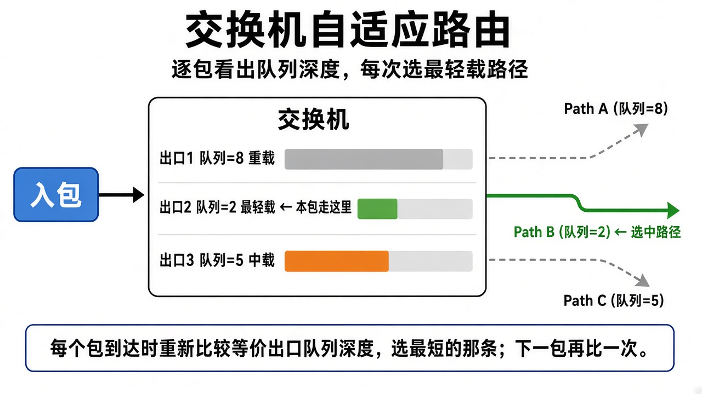

# 交换机自适应路由（简图）

一句话：包进交换机后，在一组等价出口里看谁的出队列最短，**这个包**就从最短的口出去；下一个包再比一次。



## 工作步骤

```
入包到达
    │
    ▼
取出等价路径集合（出口1 / 2 / 3 都能到目的）
    │
    ▼
读各出口当前队列深度     8    2    5
    │
    ▼
选 min = 出口2
    │
    ▼
本包从出口2转出
    │
    ▼
下一包重新读队列，不粘在出口2
```

## 和哈希 ECMP 差在哪

| | 普通 ECMP | 自适应路由（本图） |
| --- | --- | --- |
| 决策依据 | 包头哈希 | **出端口队列深度** |
| 粒度 | 一流一路径（流粘滞） | **一包一路径** |
| 拥塞时 | 哈希撞车会一直打满某一口 | 下一包自动换到更空的口 |

不做流粘滞，所以同一条流的相邻包可能走不同出口。代价是收端乱序；收益是不会把瞬时拥塞钉死在一条链路上。
