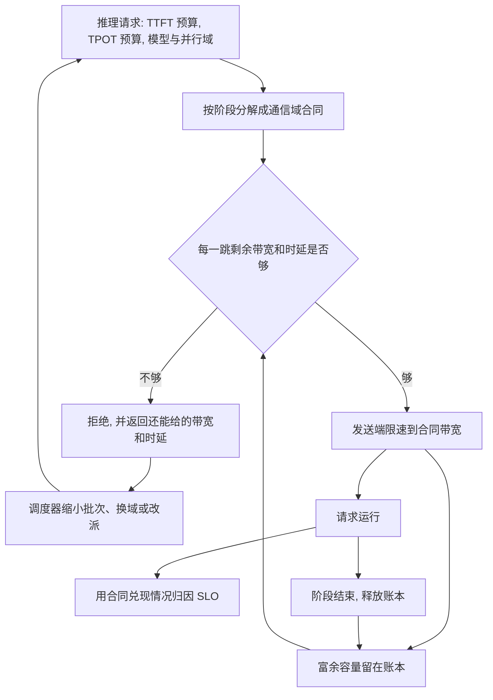

# 面向推理 SLO 的确定性网络

一句话：网络不承诺「更快」，网络承诺对每一次推理请求做一次判定——这份 TTFT / TPOT 在它的通信域上做得到，就按刚好够用的速率放行；做不到，就在进网络之前拒绝。

确定性在这里是请求级可判定。输入是业务给出的时延预算，输出是接受或拒绝，外加一份速率上限。接受之后速率上限等于需求本身，富余容量回到账本，留给更紧的 SLO。

---

## 1. 目标和口径之间的缝

阿里云对 TPN 的业务目标是提高 token 性能、降低每 token 成本。公开口径落到另一层指标上：接入带宽约增加 2.5 倍，规模约增加 10 倍，时延约下降三分之一；更远的目标写成约 50 万卡、1 GW、200 Pbps、6 μs 这一量级。光互连侧还有成本下降、可靠性提升的说法。

这些数字描述的是网络自身变大、变快。它们扩大了「有可能满足 SLO」的范围，也降低了每 Gbps 的造价。它们没有回答三件业务真正要的事：

| 业务要的答案 | 带宽、规模、时延口径能回答的 |
| --- | --- |
| 这一次请求的 TTFT、TPOT 能不能保住 | 集群更快了，单次请求没有合同 |
| 保不住时，是网络、计算还是调度的责任 | 无法拆开 |
| 一个 400 G 端口上，只需 200 G 的请求该不该把剩下的 200 G 让出来 | 默认能跑多快跑多快 |

每 token 成本可以拆成两项相乘：

```text
每 token 成本 = 每 Gbps 造价 / 每 Gbps 产出的合规 token
```

带宽和光模块成本动的是分子。分母由「端口上的容量有多少变成了达标 token」决定。请求一经放入就按链路速率抢带宽，分子下降会被分母吃掉：低 SLO 的 prefill 占满端口，高 SLO 的 decode 尾时延变差，达标 token 没有随带宽线性增加。

本文把这条缝当成前提。TPN 的规模和时延指标仍然有用，它们决定可行域有多大。下面的机制决定可行域的边界如何落到每一次请求上。

---

## 2. 闭环

调度器和网络之间只交换一份合同，不交换「请尽量快」。



五步，每一步的输入输出都固定。

### 2.1 请求画像

调度器在下发前给出：

- SLO：TTFT 预算、TPOT 预算。预算按尾部定义，例如 p99，而不是平均值。
- 工作形状：模型、序列长度、批次、prefill 与 decode 是否分离。
- 通信域：这次集合通信真正会碰到的进程组，以及它对应的网卡、上联和汇聚割集。TP、EP、PD 之间的 KV 路径是不同的域。
- 预计持续时间：prefill 窗口多长，decode 要占多久。账本按这段时间预留，而不是永久占住。

网络不从报文里猜测这些量。猜出来的 SLO 无法作为拒绝的依据。

### 2.2 分解：一次请求，按阶段各有一份合同

TTFT 和 TPOT 对网络的要求相反，不能合成一个带宽数字。

| 阶段 | 业务预算 | 网络合同 | 通信量怎么估 |
| --- | --- | --- | --- |
| Prefill | TTFT | 带宽合同。要在剩余时间里搬完激活，时延预算相对松 | 序列长度、隐藏维、层数、TP 或 EP 的通信系数，调度器可在运行前算完 |
| Decode | TPOT | 时延合同。每步消息小，速率低，排队尾时延必须落在预算内 | 每步 token 的激活或专家分发；体积小，上界看尾部排队 |
| KV 迁移 | TTFT 里的交接段，decode 开始前必须完成 | 另一条路径上的带宽合同 | 层数、KV 头、头维、序列长度、数据类型 |

分解只用减法和除法：

```text
允许的通信时间 = 该阶段时延预算 − 计算时间 − 调度余量
所需带宽       = 该阶段通信量 / 允许的通信时间
时延上界       = 允许的通信时间里，留给排队和传播的部分
```

Prefill 的合同是「在这段时间里给我这么多带宽」。Decode 的合同是「带宽可以很低，但这一跳的排队加传播不能超过这个上界」。KV 迁移跟 prefill 抢的是 TTFT，跟 decode 抢的是另一段链路，单独记账。

MoE 的 all-to-all 体积随 token 路由变化。合同按批次内的上界来写；运行中体积超出上界，按合同突破处理，见第 6 节。

### 2.3 准入：做不到就不进

网络为每条相关割集维护残量：剩余带宽，以及按已准入速率估计的排队时延。

```text
准入  =  通信域每一跳都满足
         剩余带宽 ≥ 所需带宽
         且  按该速率估计的排队时延 + 传播时延 ≤ 时延上界
```

任一跳不满足，拒绝。请求的报文不进入这条域，因此不会把已经准入的 decode 尾时延顶高。

拒绝不是只回一个布尔值。应答带上瓶颈还剩多少带宽、时延上界还剩多少。调度器据此改一次再问：缩小批次、把 prefill 切成更短的块、换一个通信域、或调到别的集群。改完仍不满足，才对用户失败。

谁优先，由产品策略决定：更紧的 TPOT、更高的价格、或在线交互优先于离线批处理。网络只回答可行或不可行，以及可行时的最小速率。策略层决定冲突时保哪一份合同，不改判定公式。

### 2.4 限速：给够就停

准入之后，发送端的速率上限等于合同带宽，下限也是它。400 G 的端口、200 G 的合同，拥塞控制的天花板是 200 G。

这是同一份合同的两面：

- 下限保证 TTFT 里的带宽预算。
- 上限保证没被这份合同买走的容量仍然在账本上，可以被下一份更紧的 SLO 买走。

只承诺下限时，流仍然可以冲到线速，残量是账面上的。上限和需求对齐，残量才调度得动。

限速做在发送端，做在报文进入端口之前：集合通信库或 QP 上的速率上限。报文已经进了队列，再靠 ECN 往回压，队列时延已经记到共享这条链路的 decode 头上。

合同之内，路径变差（故障、微突发超出模型）时，拥塞控制才往下收，并记一笔合同未兑现。它不再负责把瓶颈灌满，也不再在所有流之间做公平分带宽。公平已经由准入时的账本完成。

没有合同的流量进可回收的低优先级。回收时间必须落在下一次高 SLO 准入的时延预算里。回收赶不上 TPOT 的尾部预算，这条端口就不接受无合同流量。

### 2.5 归因：网络只对合同负责

| 合同 | 业务 SLO | 责任在哪 |
| --- | --- | --- |
| 兑现 | 达到 | 网络履行了承诺 |
| 兑现 | 未达到 | 计算、调度，或分解模型偏了 |
| 未兑现 | 未达到 | 网络对这次 SLO 负责 |

带宽增加 2.5 倍、时延下降三分之一，都产不出这张表。fabric 基线时延做到 6 μs，端口队列仍可以到几十微秒，TPOT 照样错过。反过来，某次集群没有达到公布的时延降幅，只要每份已准入合同都兑现，业务 SLO 仍然成立。

运行结束时，发送端上报实际通信时间。它和合同的差用来修正第 2.2 节的分解，而不是用来在事后改 SLO。

---

## 3. 创新点

**合同的对象是一次推理请求的通信域，并且带截止时间。** DSCP 只能表示相对优先级，不能表示「这条域上、未来这一段时间里、绝对需要 200 G、时延上界是多少」。请求结束或阶段结束，账本释放。两个通信域不相交的请求，即使集群总带宽看起来不够，也可以同时准入。

**准入发生在加速之前，拒绝是这项能力的正常输出。** 现有做法是请求先进入网络再互相抢。抢的结果用尾时延体现，此时 SLO 已经破了。先判定，进不来的请求不制造队列，已经进来的请求不被稀释。

**拥塞控制的目标从灌满管道改成给够就停。** 速率上限等于分解出来的需求。400 G 端口上的 200 G 合同被限制在 200 G。多出来的容量是可调度资源，留给 SLO 更紧的请求，而不是自动变成当前流量的加速。

**一次请求在时间上是两份以上的合同。** Prefill 要的是预算内的带宽，decode 要的是低速率下的时延上界，KV 迁移在另一条路径上。用整次请求的平均带宽来准入，prefill 阶段会不够，decode 阶段会多占。账本按阶段的起止时间预留，decode 可以预留在一份即将结束的 prefill 之后，不必把端口静态切成两半。

**SLO 的网络贡献变得可量化。** 指标从端口利用率和集群时延，换成四项：准入拒绝率、合同兑现率、合同兑现之后的 SLO 达成率、残量被重新买走的时延。端口跑满不再自动视为健康——跑满也可能说明上限没有执行，残量被无合同流量拿走。

---

## 4. 价值

**已准入的请求，TTFT 和 TPOT 可预期。** 达不到的请求在产生 token 之前被拒绝，或带着「还剩多少带宽」回到调度器。用户面对的是明确失败或改派，而不是一条慢慢变差的 token 流。

**同一端口能容纳的合规请求增加。** 需求是 200 G 的请求不再占用 400 G。省下的容量可以再接纳一份合同，也可以留给时延更紧的 decode。合规 token 随「按需求打包」增加，而不必等待下一代端口速率。

**高 SLO 业务拿得到被腾出来的资源。** 在线 decode 的时延合同和离线 prefill 的带宽合同可以共存在一个端口上：前者占的带宽小，后者不准越过自己的上限。无合同流量只有在收得回来的前提下才允许存在。

**每 token 成本的分母变大。** 光模块和端口速率继续降低每 Gbps 造价，那是分子。本方案提高每 Gbps 里变成达标 token 的比例。只优化分子时，分母仍由「谁把端口占满」决定。

**容量规划从「把利用率做高」改成「把账本做准」。** 利用率低于线速可以是正确状态：那一段是留给尚未到来的高 SLO 请求的残量。采购和扩容看的是拒绝率和残量耗尽的频率，而不是平均吞吐。

---

## 5. 例子

以下数字只说明机制，不是某次测量。

一个 400 G 端口上已有两份合同：

| 合同 | 速率上限 | 时延要求 |
| --- | --- | --- |
| 在线 decode 的通信域 | 80 G | 紧，排队必须留在 TPOT 预算内 |
| 离线 prefill | 200 G | 松，落在 TTFT 预算内即可 |
| 合计 | 280 G | |
| 账本剩余 | 120 G | |

第三份请求的分解结果是 200 G。120 G 小于 200 G，准入失败。网络返回剩余 120 G。调度器可以把 prefill 切小再申请，或把这份请求放到别的域。已准入的 80 G 和 200 G 维持原上限，decode 的排队假设不被第三份请求改写。

若第三份请求直接进入、再由拥塞控制把 400 G 分成三份，三份都会偏离自己的合同，decode 的尾时延首先被破坏。拒绝保住的是前两份 SLO。

另一份算法含义：两份各 200 G 的合同把端口占满之后，任何一方都不允许在对方安静时冲到 400 G，除非这 200 G 的冲刺被标成可回收流量，并且回收时间短于等待中的高 SLO 时延预算。冲刺占用的容量不在账本里，新合同就不能依赖它。

---

## 6. 成立条件

分解会有误差。估高了，限速过严，端口上的合规 token 比本可以做到的少，收益被自己吃掉。估低了，合同显示兑现、SLO 仍然错过，归因会错怪计算。上线时带余量，用每份完成请求的实际通信时间把余量收紧。余量本身也记在账本上，避免「每份合同都悄悄多占一截」。

通信域必须按阶段拆开。MoE all-to-all 和 PD 的 KV 迁移与训练集合通信、与 decode 小消息共享 fabric 时，各写各的合同。专家路由造成的体积波动，用批次上界覆盖；超出上界视为合同突破，网络记未兑现，调度器决定中止或降级，而不是悄悄继续占带宽。

限速点在发送端。交换侧的策略可以做第二道，第一道必须在报文进端口之前生效。

拒绝要对调度器有效。网关若把同一次请求立刻重放到同一条已经拒绝的域上，准入只是多了一次往返。重试必须带新的合同（更小的带宽、更松的时延，或另一个通信域）。

传播时延和基础 RTT 不会因为准入而变小。可行域的上限仍由端口速率、跳数和基础时延决定。TPN 一类工作把这个上限做大；本方案在上限之内做判定和限速。判定不能变出账本上没有的带宽。

---

## 7. 和现有口径的对照

| | 以 TPN 公开口径为代表的网络指标 | 灌满式拥塞控制 | 本方案 |
| --- | --- | --- | --- |
| 优化对象 | 带宽、规模、时延、光互连成本 | 瓶颈利用率和流之间的公平 | 已准入请求的 TTFT、TPOT |
| 请求进入之前 | 不判定 | 不判定 | 按通信域残量接受或拒绝 |
| 速率 | 线速能力越强越好 | 收到拥塞信号前尽量灌满 | 上限等于分解出的需求 |
| 富余带宽 | 被当前流量使用 | 被当前流量使用 | 留在账本，供更紧的 SLO 购买 |
| 对业务 SLO 的说法 | 无法从这些指标推出某次请求是否达标 | 无法归因 | 合同兑现与否就是网络责任 |
| 端口跑满 | 倾向视为性能好 | 视为算法目标 | 可能是上限未执行 |

「把每条流都做得接近线速」同样是在扩大可行域：干扰变小，同样的 SLO 更容易被满足。它仍然不会拒绝一份已经放不下的请求，也仍然允许一份 200 G 就够的流占满 400 G。判定和限速加在这类 fabric 之上，而不是替换它。

---

## 8. 调度器与网络的接口

把上面的闭环收成三次交换，避免实现时各自理解「确定性」。

**申请。** 通信域、阶段、所需带宽、时延上界、起止时间。

**应答。** 接受，并给出速率上限和合同号。或者拒绝，并给出瓶颈剩余带宽和剩余时延，供调度器改写合同后再申请。

**结束。** 释放账本。附带实际通信时间，只用于校准分解模型。

网络侧为此落三样状态：按割集而不是按整网一个数的残量账本；发送端的速率上限；无合同流量的可回收等级，以及这个等级的回收时间是否配得上当前最紧的时延预算。
