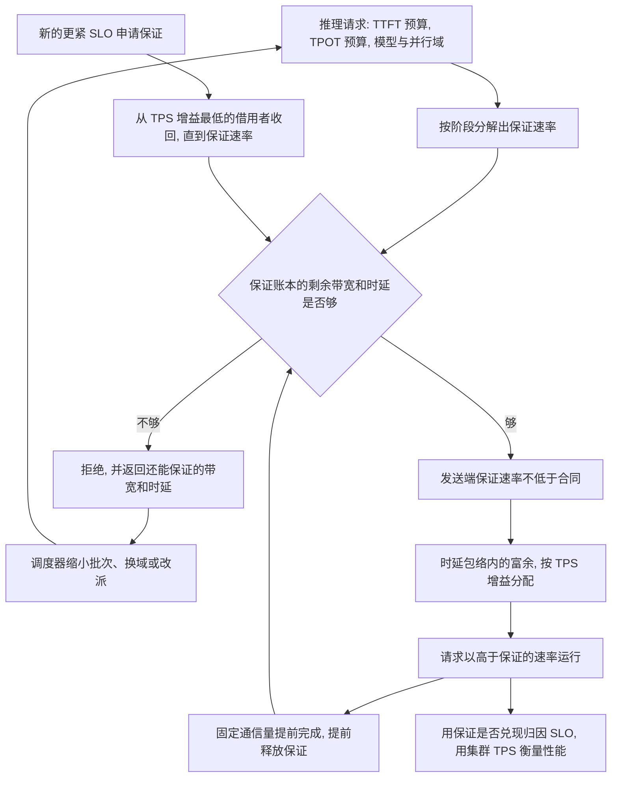

# 面向推理 SLO 的确定性网络

一句话：网络对每一次推理请求先做判定。TTFT / TPOT 做得到，就保证一份刚好满足预算的最低速率，并在不破坏任何已准入合同时，把端口上还空着的容量用来提高 TPS。做不到，就在进网络之前拒绝。

确定性是请求级可判定。输入是业务给出的时延预算，输出是接受或拒绝，外加一份保证速率。保证速率是下限。运行速率可以高于下限，多出来的部分随时能收回。

---

## 1. 目标和口径之间的缝

阿里云对 TPN 的业务目标是提高 token 性能、降低每 token 成本。公开口径落到另一层指标上：接入带宽约增加 2.5 倍，规模约增加 10 倍，时延约下降三分之一；更远的目标写成约 50 万卡、1 GW、200 Pbps、6 μs 这一量级。光互连侧还有成本下降、可靠性提升的说法。

这些数字描述的是网络自身变大、变快。它们扩大了「有可能满足 SLO」的范围，也降低了每 Gbps 的造价。它们没有回答三件业务真正要的事：

| 业务要的答案 | 带宽、规模、时延口径能回答的 |
| --- | --- |
| 这一次请求的 TTFT、TPOT 能不能保住 | 集群更快了，单次请求没有合同 |
| 保不住时，是网络、计算还是调度的责任 | 无法拆开 |
| 一个 400 G 端口上，只需 200 G 才能达标的请求，剩下的 200 G 该留给谁 | 默认能跑多快跑多快 |

每 token 成本可以拆成两项相乘：

```text
每 token 成本 = 每 Gbps 造价 / 每 Gbps 产出的合规 token
```

带宽和光模块成本动的是分子。分母由「端口上的容量有多少变成了达标 token」决定。请求一经放入就按链路速率抢带宽，分子下降会被分母吃掉：低 SLO 的 prefill 占满端口，高 SLO 的 decode 尾时延变差，达标 token 没有随带宽线性增加。

本文把这条缝当成前提。TPN 的规模和时延指标仍然有用，它们决定可行域有多大。下面的机制决定可行域的边界如何落到每一次请求上，以及边界之内的空闲容量如何变成 TPS。

---

## 2. 闭环

调度器和网络之间交换的是一份保证合同。保证合同管 SLO。运行速率在保证之上浮动，管 TPS。



### 2.1 请求画像

调度器在下发前给出：

- SLO：TTFT 预算、TPOT 预算。预算按尾部定义，例如 p99。这是约束，是速率下限的来源。
- 工作形状：模型、序列长度、批次、prefill 与 decode 是否分离。
- 通信域：这次集合通信真正会碰到的进程组，以及它对应的网卡、上联和汇聚割集。TP、EP、PD 之间的 KV 路径是不同的域。
- 预计持续时间：按保证速率估算的占用时间。运行快于保证速率时，结束时间提前，账本提前释放。

网络不从报文里猜测这些量。猜出来的 SLO 无法作为拒绝的依据。

### 2.2 分解：保证速率是达标下限

TTFT 和 TPOT 对网络的要求相反，不能合成一个带宽数字。分解得到的是保证速率，也就是 SLO 仍成立的最低速率。

| 阶段 | 业务预算 | 保证合同 | 通信量怎么估 |
| --- | --- | --- | --- |
| Prefill | TTFT | 带宽下限。在剩余时间里搬完激活即可达标 | 序列长度、隐藏维、层数、TP 或 EP 的通信系数，调度器可在运行前算完 |
| Decode | TPOT | 时延上界，对应一个很低的带宽下限 | 每步 token 的激活或专家分发；体积小，上界看尾部排队 |
| KV 迁移 | TTFT 里的交接段，decode 开始前必须完成 | 另一条路径上的带宽下限 | 层数、KV 头、头维、序列长度、数据类型 |

```text
允许的通信时间 = 该阶段时延预算 − 计算时间 − 调度余量
保证速率       = 该阶段通信量 / 允许的通信时间
时延上界       = 允许的通信时间里，留给排队和传播的部分
```

对交互式 decode，单流 TPS 和 TPOT 是倒数关系：

```text
单流 TPS 下限 = 1 / TPOT 预算
单步时间     = 计算时间 + 单步通信量 / 当前速率
单流 TPS     = 1 / 单步时间
```

保证速率对应的是单流 TPS 下限。当前速率高于保证速率、且这一步仍受通信限制时，单流 TPS 上升。步骤已经算力受限时，再加带宽不产生新的 token。

Prefill 和 KV 迁移的通信量在一次请求里是定值。对定值通信量：

```text
通信量 = 速率 × 占用时间
```

把速率压到保证速率，字节总量不变，占用时间被拉长。GPU 在这段时间里等通信，decode 更晚开始，准入租约更晚释放，下一份请求更晚进入。集群 TPS 因此下降，同时每份请求的 TTFT 仍落在预算内。

MoE 的 all-to-all 体积随 token 路由变化。保证合同按批次内的上界来写；运行中体积超出上界，按合同突破处理，见第 6 节。

### 2.3 准入：只对保证速率做判定

网络为每条相关割集维护两本账：

| 账本 | 记什么 | 用来做什么 |
| --- | --- | --- |
| 保证账本 | 已准入合同的保证速率之和，以及按这个速率估计的排队时延 | 接受或拒绝新合同 |
| 借用账本 | 当前实际速率高出保证速率的部分 | 提高 TPS；新合同需要时收回 |

```text
准入  =  通信域每一跳都满足
         保证账本剩余带宽 ≥ 新合同的保证速率
         且  按全部保证速率估计的排队时延 + 传播时延 ≤ 时延上界
```

判定不把借用速率算进「已经占用」。借用者在新合同生效前会被压回保证速率，所以对新合同来说，那一段容量仍然在。任一跳的保证账本不够，拒绝。请求的报文不进入这条域。

拒绝时带回瓶颈还能保证多少带宽、时延上界还剩多少。调度器据此改一次再问：缩小批次、把 prefill 切成更短的块、换一个通信域、或调到别的集群。改完仍不满足，才对用户失败。

谁优先拿到保证，由产品策略决定：更紧的 TPOT、更高的价格、或在线交互优先于离线批处理。网络只回答可行或不可行，以及可行时的保证速率。

### 2.4 速率：保证给够，富余用来提高 TPS，需要时收回

发送端有两个数。保证速率是地板，运行速率是当前允许的发送速率。地板在合同期内不动。运行速率在地板和时延包络之间移动。

时延包络是这条割集上还能再加多少速率，使得按该速率估计的排队时延仍然满足每一份已准入合同的时延上界。包络把「灌满管道」挡在 TPOT 外面。包络之内的富余才允许借出。

富余按每多 1 Gbps 带来的集群 TPS 增量分配，高的先拿：

1. 仍受通信限制的 decode。单步时间里通信占一块，加速率就缩短 TPOT，单流 TPS 上升，用户直接看到。
2. 正占着 GPU 的定值传输，也就是 prefill 和 KV 迁移。加速率就缩短占用，GPU 和保证租约提前释放，下一份请求提前开始，集群 TPS 上升。
3. 已经算力受限的阶段。增量接近零，不再给带宽。

新的保证合同到达时，从 TPS 增量最低的借用者开始收，收到各自的保证速率为止。收回时间必须落在新合同的时延预算里，收回完成之后新合同才开始发送。这样已准入请求的速率不会低于自己的地板，SLO 维持；新请求的排队模型仍然按保证速率成立。

没有合同的流量排在所有借用者之后，第一个被收回。收回赶不上当前最紧的时延预算，这条端口就不接受无合同流量。

限速和提速都做在发送端，做在报文进入端口之前。报文已经进了队列，再往回压，队列时延已经记到共享这条链路的 decode 头上。

路径变差、实际速率低于保证速率时，记一笔合同未兑现。拥塞控制在这里的职责是守住地板、并在包络内把富余送给 TPS 增量最高的阶段。流与流之间的公平由保证账本完成。

一种边界要单独写出：时延包络刚好等于全部保证速率之和时，这条割集上没有可以安全借出的富余。此时再提速会破坏已准入的 TPOT。集群 TPS 要再提高，就靠把 prefill、KV 和 decode 分到不同的割集，或由调度器放宽预算，而不是在这条已经贴着时延上界的链路上加速率。

### 2.5 归因：SLO 看保证，性能看 TPS

| 保证合同 | 业务 SLO | 集群 TPS | 责任在哪 |
| --- | --- | --- | --- |
| 兑现 | 达到 | 相对算力上限仍有缺口，且当时时延包络里有富余没分出去 | 速率分配没有把富余用在 TPS 上 |
| 兑现 | 达到 | 已贴近算力上限，或时延包络里已经没有富余 | 网络履行了承诺，TPS 受算力或时延约束限制 |
| 兑现 | 未达到 | — | 计算、调度，或分解模型偏了 |
| 未兑现 | 未达到 | — | 网络对这次 SLO 负责 |

只看 SLO 会把「全部请求都卡在 TPOT 预算上」判成健康。那是单流 TPS 的下限，也是定值传输把 GPU 占满整个预算窗口的状态。所以健康指标同时看合同兑现率和集群 TPS。

运行结束时，发送端上报实际通信时间和实际占用时间。通信时间和保证模型的差，用来修正第 2.2 节的保证速率。占用时间提前结束，用来修正租约，让保证账本提早空出来。

---

## 3. 为什么「控速到刚好达标」会让 TPS 下降

把运行速率钉在保证速率上，SLO 仍然成立，TPS 会掉。原因有三层。

**单流 TPS 被钉在下限上。** TPOT 预算是时延上限，对应单流 TPS 的下限。400 G 端口上 decode 保证速率 80 G 就能把 TPOT 控制在预算内，于是运行速率也被收成 80 G。步骤若仍受通信限制，本可以更高的单流 TPS 不会出现。SLO 全绿，用户看到的生成速度停在预算那一档。

**定值通信量被摊到更长时间。** Prefill 要搬的字节是定值。200 G 搬完需要的时间，是 400 G 的两倍，字节总量相同。被拉长的是 GPU 等待、decode 开始和准入租约。这段时间里端口上「省下来」的 200 G，如果没有另一份请求同时要用，就是空闲。空闲不产生 token。下一份请求本来可以在一半时间后拿到整份保证，现在要等满整个窗口。集群 TPS 下降，每一份请求的 TTFT 仍小于等于预算。

**保证额度让出来，只在有人同时需要时才换得回 TPS。** 两份请求的通信域重叠、且后一份的 SLO 更紧时，前一份压到保证速率，后一份才能准入。这是该让出的情形。没有重叠的申请者时，同样的压速只增加占用时间。原方案把这两种情形合成一个动作，所以会出现 SLO 不违约、TPS 下降。

改进后的划分是：保证账本负责「让出去」，借用账本负责「没有人接的时候用来提速，有人接的时候按回收时限交还」。

---

## 4. 创新点

**合同的对象是一次推理请求的通信域，并且带截止时间。** 相对优先级表达不了「这条域上、未来这一段时间里、至少保证 200 G、时延上界是多少」。请求结束或阶段结束，保证账本释放。跑得比保证速率快，释放提前。两个通信域不相交的请求，即使集群总带宽看起来不够，也可以同时准入。

**准入发生在加速之前，拒绝是这项能力的正常输出。** 进不来的请求不制造队列，已经进来的请求不被稀释。准入只消耗保证账本，所以为了 TPS 借走的速率不会把后来的合格请求挡在门外。

**保证速率和运行速率分开。** 保证速率等于分解出来的达标下限，用来判定和兜底。运行速率在时延包络内按 TPS 增量上浮，新合同到达时收回。400 G 端口上 200 G 的保证，在有更紧的 SLO 同时需要另外 200 G 时被压回 200 G；在没有申请者、且压回 200 G 会拉长 GPU 占用时，运行速率用满包络，提前完成、提前释放。

**一次请求在时间上是两份以上的合同。** Prefill 要的是预算内的带宽下限，decode 要的是低速率下的时延上界，KV 迁移在另一条路径上。账本按阶段的起止时间预留。decode 可以预留在一份即将结束的 prefill 之后。prefill 提前跑完，decode 的预留跟着前移。

**SLO 和 TPS 分开记账。** 合同兑现率回答网络有没有保住 TTFT / TPOT。集群 TPS、以及「GPU 在等通信、同时时延包络里仍有富余」的时间比例，回答有没有白丢性能。端口在包络之内跑满，是 TPS 目标；超出包络的跑满，会破坏 TPOT。

---

## 5. 价值

**已准入的请求，TTFT 和 TPOT 有下限保证。** 达不到保证的请求在产生 token 之前被拒绝，或带着「还能保证多少」回到调度器。用户面对的是明确失败或改派，而不是一条慢慢变差的 token 流。

**达标之上的速度留给 TPS。** 没有竞争保证合同时，定值传输用富余带宽提前完成，交互式 decode 在仍受通信限制时把单流 TPS 做到高于 `1 / TPOT 预算`。竞争出现时，富余被收回，已准入请求落回保证速率，SLO 维持。

**同一端口能容纳的合规请求增加，而且增加得更早。** 新合同看的是保证账本，一份 200 G 就能达标的请求不会把另外 200 G 写成永久保证。它若借走这 200 G 并提前完成，保证租约在一半时间结束，下一份请求更早准入。合规 token 随「按保证打包、按富余提速」增加。

**高 SLO 业务拿得到被让出的保证额度。** 在线 decode 的时延合同和离线 prefill 的带宽合同可以共存在一个端口上。Prefill 可以借用富余，借用的上限是 decode 的时延包络，交还的时限是下一份保证合同的时延预算。

**每 token 成本的分母变大。** 光模块和端口速率继续降低每 Gbps 造价，那是分子。保证账本提高「每 Gbps 里有多少落在达标请求上」，借用账本提高「达标请求实际产出 token 的速度」。只把速率钉在下限，分母里的 TPS 会停在 SLO 地板上。

---

## 6. 例子

以下数字只说明机制，不是某次测量。

一个 400 G 端口上已有两份保证合同：

| 合同 | 保证速率 | 时延要求 | 高于保证速率时 TPS 怎么变 |
| --- | --- | --- | --- |
| 在线 decode | 80 G | 紧，排队必须留在 TPOT 预算内 | 步骤仍受通信限制时，单流 TPS 上升 |
| 离线 prefill | 200 G | 松，落在 TTFT 预算内即可 | 字节定值，提前完成，GPU 和租约提前释放 |
| 保证合计 | 280 G | | |
| 保证账本剩余 | 120 G | | |

时延包络允许在 280 G 之上再跑 120 G，则这 120 G 先给仍受通信限制的 decode；decode 已经算力受限，就给 prefill，缩短它的占用。两份合同的 SLO 都比「刚好卡在预算上」更好，集群 TPS 更高。

第三份请求的保证速率是 200 G。保证账本只剩 120 G，准入失败。网络返回还能保证 120 G。调度器可以把 prefill 切小再申请，或把这份请求放到别的域。判定之前，借用中的速率先收回，decode 和 prefill 落回 80 G 和 200 G，已准入的排队假设不变。

若 prefill 在第三份请求到达前已经借速跑完，它的 200 G 保证已经释放。此时保证账本剩余至少 200 G，第三份请求可以准入。这是 TPS 改进在准入时间上的体现：同样的 SLO，第二份请求更早开始产生 token。

若第三份请求不经准入、直接进入，再由拥塞控制把 400 G 分成三份，三份都会低于自己的保证速率，decode 的尾时延先被破坏。

时延包络若已经贴在 280 G 上，那 120 G 不能借出。此时强行把 prefill 提到 400 G，decode 的 TPOT 会破。这条端口上的 TPS 头寸已经用完。

---

## 7. 成立条件

分解会有误差。保证速率估高了，准入过严，本可以接纳的请求被拒绝，集群 TPS 下降。估低了，合同显示兑现、SLO 仍然错过，归因会错怪计算。上线时带余量，用每份完成请求的实际通信时间把保证速率收紧。余量记在保证账本上。

通信域必须按阶段拆开。MoE all-to-all 和 PD 的 KV 迁移与 decode 小消息共享一条割集时，各写各的保证合同，富余分配仍受最紧的时延上界约束。专家路由造成的体积波动，用批次上界覆盖；超出上界视为合同突破，网络记未兑现，调度器决定中止或降级。

提速和收回都在发送端生效。交换侧可以做第二道。收回时间做不到新合同的时延预算之内，这段富余就不能借出，运行速率保持在保证速率。

拒绝要对调度器有效。重试必须带新的合同：更小的保证速率、更松的时延，或另一个通信域。

传播时延和基础 RTT 不会因为准入或借速而变小。可行域的上限仍由端口速率、跳数和基础时延决定。TPN 一类工作把这个上限做大。本方案在上限之内做判定，并在时延包络之内把富余变成 TPS。

---

## 8. 和现有口径的对照

| | 以 TPN 公开口径为代表的网络指标 | 灌满式拥塞控制 | 速率钉在达标下限 | 本方案 |
| --- | --- | --- | --- | --- |
| 优化对象 | 带宽、规模、时延、光互连成本 | 瓶颈利用率和流之间的公平 | 已准入请求的 TTFT、TPOT | 在 TTFT、TPOT 约束下的集群 TPS |
| 请求进入之前 | 不判定 | 不判定 | 按保证速率接受或拒绝 | 按保证速率接受或拒绝 |
| 运行速率 | 线速能力越强越好 | 收到拥塞信号前尽量灌满 | 等于保证速率 | 不低于保证速率；时延包络内按 TPS 增量上浮 |
| 富余带宽 | 被当前流量使用 | 被当前流量使用 | 留空，等待更紧的 SLO | 先提高已准入请求的 TPS，新保证合同到达时收回 |
| 对 TPS 的影响 | 更快的管道提高上限，单次请求无保证 | 尾时延变差时达标 token 下降 | SLO 可全绿，单流和集群 TPS 停在下限 | SLO 守住下限，有富余时 TPS 高于下限 |
| 对业务 SLO 的说法 | 无法从这些指标推出某次请求是否达标 | 无法归因 | 合同兑现与否就是网络责任 | 兑现看 SLO，富余分配看 TPS |
| 端口跑满 | 倾向视为性能好 | 视为算法目标 | 视为没有执行上限 | 包络之内跑满是 TPS 目标 |

「把每条流都做得接近线速」同样是在扩大可行域：干扰变小，同样的 SLO 更容易被满足，TPS 上限更高。它仍然不会拒绝一份已经放不下的请求。判定、保证速率和可收回的提速加在这类 fabric 之上。

---

## 9. 调度器与网络的接口

**申请。** 通信域、阶段、保证速率、时延上界、按保证速率估算的起止时间。

**应答。** 接受，并给出保证速率、当前时延包络内允许的运行速率、合同号。或者拒绝，并给出瓶颈还能保证的带宽和剩余时延，供调度器改写合同后再申请。

**运行中。** 网络可以下调运行速率，但不低于保证速率。下调发生在新保证合同收回借用、或时延包络变窄的时候。占用提前结束时，调度器收到提前释放，保证账本同步前移。

**结束。** 释放尚未释放的保证。附带实际通信时间和实际占用时间，前者校准保证速率，后者核对租约。

网络侧落四样状态：按割集记账的保证账本；按 TPS 增量分配的借用账本；每条割集的时延包络；发送端的保证速率和运行速率。无合同流量排在借用者之后，其收回时间必须配得上当前最紧的时延预算。
